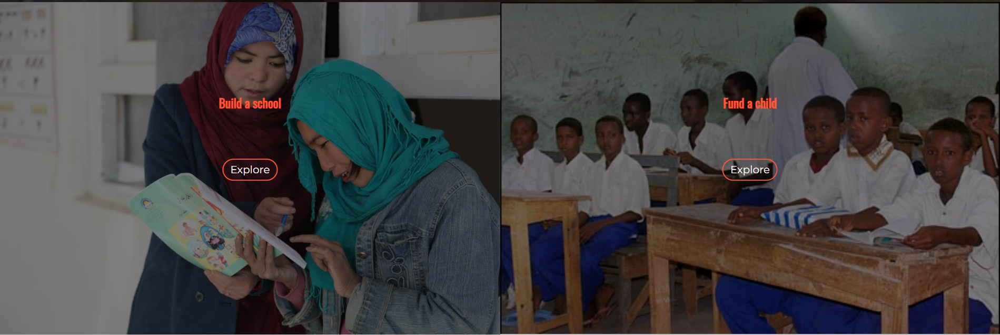
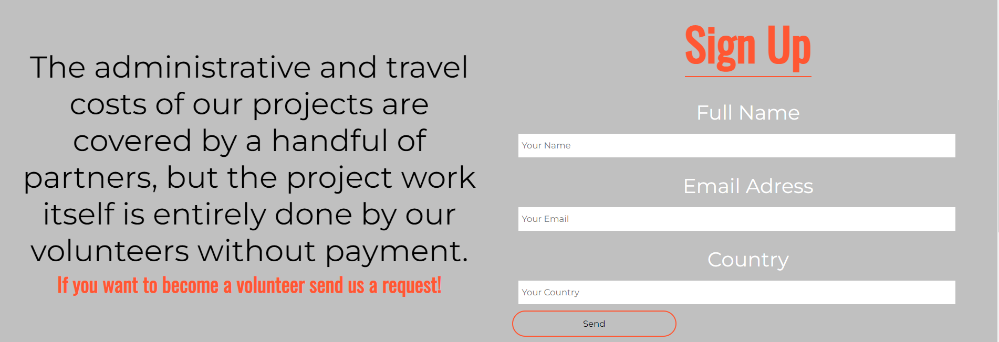

# Education for EVERYBODY (EFE)
According to statistics, countries with a high poverty rate also have very low literacy rate and enrolled children in schools. Poverty is the reason that quality education is a distant dream for a lot of children that live in these countries. Education for EVERYBODY (EFE) is a donation site for people with compassion who want to help these children utilise their right for education and people who want to make a difference by their donations. EFE sees itself as a reliable and secure link between the donors and the children in need. This is because one of our core principle is that all of the donation money, 100% uncut, will go to bringing quality education for children who cannot afford it.

## Features

**Navigation Bar:**

- This is a feature that exists in all pages of the site where users can comfortably navigate themselves to different pages. In here is a Logo link, link to about page, link to contact page and a donation button.

- This feature not only makes it easy for the users to go from one page to another but it also clearly shows a donation option
for people who want to donate.

**Landing page video:**

- This section has a video and a heading of the website's name on it. Underneath that is a description of our ‘’100% uncut’’ principle.

- The purpose of this section is to show the users what the site is about and draw their attention to it by describing our important and distinct principle.

**The projects section:**

- In this part there are the projects that the site EFE is working on currently each with an image, title and a ¨read more¨ link which takes you to the description of the projects.

- This section will be updated when new projects begin.

**The volunteer section:**

- The volunteer section provides information about how we run our projects and it includes a volunteer request form.

- This section allows the users who are interested in working with our projects to sign up for volunteer work.

**The sponsors and donation message:**

- This section states how much it costs to fund a child and provides logos of our partners.

- The donation message encourages users to donate.

**The footer:**

- The footer consists of the logo, a quote, links to social media and links to other important sections of the website.

- This section gives users a clickable link to navigate to important  sections of the website without scrolling up or using the back button.

**About us:**

- About us includes information about the site, photos and a subscription form.

- This page is important because it provides the user with information about EFE and what they do.

**The contact page:**

- In this page there is a form by which the user can contact EFE and a photo.

- The contact page gives the user a chance to communicate with EFE if they have any questions or other messages.

**The project description Page:**

- This page describes the project and it gives the user the banking info where they can send their donation.

- In this section the user can read about the project that they are interested in and have a chance to donate to the project.

## Validator Testing

- HTML
    * Validated using [W3C](https://validator.w3.org/) HTML validator and no errors were found.

- CSS
    * Validated using [Jigsaw](https://jigsaw.w3.org/css-validator/) validator and no error were found.

- I have also checked and tested the site on different browsers such as Chrome, Firefox, Edge and Safari. By using the chrome dev tools and [Am I Responsive?](https://ui.dev/amiresponsive?url=https://8000-jalalk1244-educationfor-fd3e2i2syhp.ws-eu62.gitpod.io/index.html) website have i checked and confirmed the responsiveness of the site.

- I have tested the links that has an href other than "#" and all of them work.

- Lighthouse report (Chrome dev-tool)
    

## Deployment

## Credit

- **Content**

    * The facts about Somalia in the project page is taken from [World Bank Blogs](https://blogs.worldbank.org/africacan/data-development-poverty-and-policy-somalia#:~:text=Nearly%20seven%20of%2010%20Somalis,future%20economic%20and%20social%20development.)
    
    * The icons used in the projects page and in the footer were taken from [Fontawesome](https://fontawesome.com/)

    * The fonts used in this site was taken from [google fonts](https://fonts.google.com/) 

    * The quote in the footer was taken from [MomentPath](https://www.momentpath.com/blog/owners-directors-inspiration-inspirational-quotes-about-teaching-children)

    * The hamburger menu was learned from a [youtube tutorial](https://www.youtube.com/watch?v=XM7sEpl0f7c&t=14s)

- **Media**
    
    * links the photos and vidoes:
        - [Save the children logo](https://www.thirdsector.co.uk/save-children-admits-failings-leaked-report-backs-inappropriate-behaviour-claims/management/article/1458983)
        - [Amnesty logo](https://www.cardiffstudents.com/activities/society/amnestyinternational/)
        - [Unicef logo](https://ceowatermandate.org/resources/child-rights-global-supply-chains/)
        - [Build schools](https://www.unicef.org/afghanistan/education)
        - [Fund a child](https://www.unicef.org/afghanistan/education)
        - [Landing background vidoe](https://youtu.be/gldQxy5aroE)
        - [The photo before sponsers section](https://www.washingtonpost.com/world/national-security/state-department-employees-split-with-tillerson-on-child-soldiers-list/2017/11/21/ea906b8b-6d72-4e88-bb57-197a38baf164_story.html)
        - [first photo of about page](https://www.unicef.org/stories/radio-based-learning-gets-its-day-sun-mali)
        - [second photo of about page](https://www.unicef.org/southsudan/what-we-do/education)
        - [third photo of about page](https://www.unicef.org/afghanistan/education)
        - [photo of the contact page](https://www.unicef.org/mali/en/recits/une-alternative-educative-a-nianabougou)
        - [project one photo](https://www.nbcnews.com/news/world/nearly-half-afghan-children-don-t-go-school-girls-disproportionately-n879586)
        - [project two photo](https://islamicreliefsomalia.org/education/)